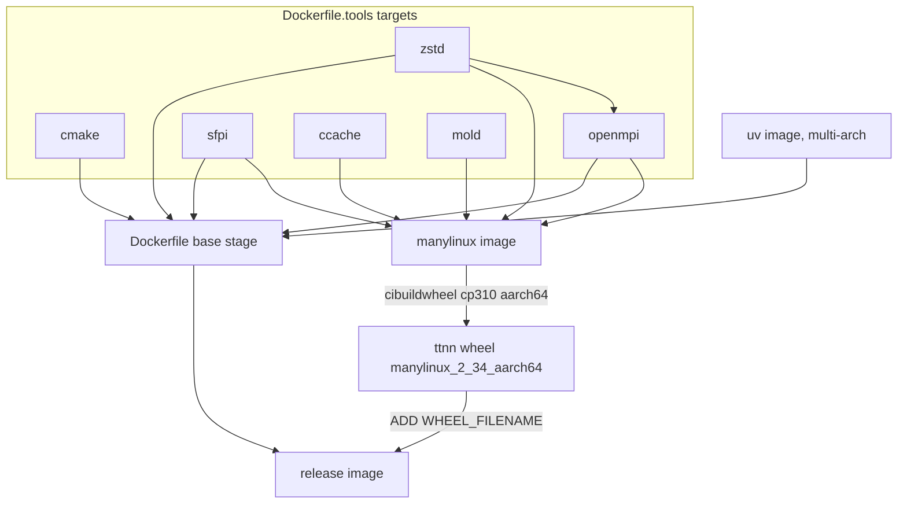

# Plan: Native aarch64 build of the `release` Docker image

Status: **implemented and validated on this host (2026-09-24)** — see §8 for results and
deviations from the plan.
Target: `docker buildx bake release` producing a native `linux/arm64` image on this host.
Out of scope (by decision): `dev`, `dev-light`, `ci-*`, `release-models`, tt-smi, QEMU emulation.
Preference: build from source rather than fall back to older distro packages.

---

## 0. How to build for ARM64 (verified commands)

Run on a native aarch64 host with Docker + buildx (no QEMU). All commands start from the
tt-metal repo root unless noted. The rest of this document is the design record behind them.

**Prerequisites:** `docker buildx` (docker driver is fine), `pipx`, `git`, ~100 GB free disk.

### 0.1 Build the tool images + manylinux image

Bake builds the tool targets (`cmake zstd openmpi sfpi ccache mold`) automatically as
contexts. The `BUILDKIT_SYNTAX` override is required on arm64 because the repo's
`# syntax=` frontend image (`ghcr.io/tenstorrent/.../dockerfile-frontend`) is amd64-only (§4.2).

```bash
docker buildx bake -f dockerfile/docker-bake.hcl \
  --set '*.args.BUILDKIT_SYNTAX=docker/dockerfile:1.25' \
  manylinux
# -> tt-metalium-manylinux:local (openmpi is compiled from source: ~11 min on 80 cores)
```

### 0.2 Build the aarch64 ttnn wheel

Use a separate **clone** (not a `git worktree`: its `.git` file points at a host path that
doesn't exist inside the cibuildwheel container, which breaks `setuptools_scm` versioning).
cibuildwheel copies its *current directory* into the container, so run it from the clone root.

```bash
SRC=$PWD
BUILD=$(realpath ..)/tt-metal-arm64

git clone -q "$SRC" "$BUILD"                       # local clone: hardlinked objects, keeps tags
git -C "$BUILD" checkout -q "$(git rev-parse HEAD)"  # clones the branch tip; pin the exact commit
git -C "$BUILD" submodule update --init --recursive --jobs 4
cp -a .cpmcache "$BUILD"/ 2>/dev/null || true       # optional: reuse CPM sources (arch-neutral)

cd "$BUILD"
CIBW_BUILD='cp310-manylinux_aarch64' \
CIBW_ARCHS=aarch64 \
CIBW_SKIP='*-musllinux_*' \
CIBW_BUILD_FRONTEND=build \
CIBW_MANYLINUX_AARCH64_IMAGE=tt-metalium-manylinux:local \
CIBW_ENVIRONMENT='CIBW_BUILD_TYPE=Release CIBW_ENABLE_TRACY=OFF CIBW_ENABLE_LTO=OFF CCACHE_TEMPDIR=/tmp/ccache CMAKE_BUILD_PARALLEL_LEVEL=48' \
CIBW_BEFORE_BUILD='mkdir -p /tmp/ccache' \
CIBW_TEST_COMMAND='python -c "import ttnn"' \
pipx run cibuildwheel==2.23.2 --platform linux --output-dir wheelhouse
cd "$SRC"
# -> $BUILD/wheelhouse/ttnn-<ver>-cp310-cp310-manylinux_2_34_aarch64.whl (~5 min at -j48)
```

`CMAKE_BUILD_PARALLEL_LEVEL` caps Ninja (default `nproc`+2); unity builds can take several GB
per job, so size it to RAM (48 was fine with 125 GB). Only local ccache is used; the CI remote
ccache (S3/Garage) settings are deliberately omitted.

### 0.3 Build the `release` image

The wheel must be inside the build context (repo root); `release` `ADD`s it by filename.

```bash
cp "$BUILD"/wheelhouse/ttnn-*-manylinux_2_34_aarch64.whl .
WHEEL=$(ls ttnn-*-manylinux_2_34_aarch64.whl)

docker buildx bake -f dockerfile/docker-bake.hcl \
  --set '*.args.BUILDKIT_SYNTAX=docker/dockerfile:1.25' \
  --set "release.args.WHEEL_FILENAME=$WHEEL" \
  release
# -> tt-metalium-release:local (arm64, ~3.3 GB)
```

### 0.4 Verify

```bash
docker image inspect tt-metalium-release:local --format '{{.Architecture}}'   # arm64
docker run --rm tt-metalium-release:local bash -lc \
  'uname -m && python -c "import ttnn" && mpirun --version | head -1'

# Device smoke test (same as publish-release-image.yaml), if a Tenstorrent card is present.
# Set ARCH_NAME to the card: blackhole (p150a, verified) or wormhole_b0.
docker run --rm --device /dev/tenstorrent -v /dev/hugepages-1G:/dev/hugepages-1G \
  -v "$BUILD":/work -w /work -e ARCH_NAME=blackhole tt-metalium-release:local bash -lc "
    uv pip install --extra-index-url https://download.pytorch.org/whl/cpu \
      --index-strategy unsafe-best-match 'torch>=2.7.1' &&
    uv pip install 'numpy>=1.24.4,<2' pytest &&
    pytest tests/end_to_end_tests"
```

### 0.5 Variants and cleanup

- **Ubuntu 24.04 / Python 3.12** (not yet run): build the wheel with
  `CIBW_BUILD='cp312-manylinux_aarch64'`, then prefix the release bake with
  `UBUNTU_VERSION=24.04 PYTHON_VERSION=3.12`.
- **Individual tools only:** `docker buildx bake -f dockerfile/docker-bake.hcl cmake zstd openmpi sfpi ccache mold`
  (Dockerfile.tools has no `# syntax=` line, so no override needed).
- **Cleanup:** `rm -rf "$BUILD" ttnn-*-manylinux_2_34_aarch64.whl`

---

## 1. Host facts (measured)

| Item | Value |
|---|---|
| Arch / OS | `aarch64`, Ubuntu 24.04.4 |
| CPU / RAM | 80 cores, 125 GB |
| Docker | Engine 29.7.2 (`arm64`), buildx 0.36.1, builder `default` (docker driver, BuildKit 0.32.2, overlay2 store) |
| Disk | **70 GB free (92% used)**. `docker system df`: ~187 GB reclaimable images, ~82 GB reclaimable build cache |
| Repo | `v0.78.0-dev20260830`, 15 GB working tree incl. stale `build/`, `build_Release/`, `.cpmcache/` |

---

## 2. What `release` actually depends on

`release` is not self-contained: it `ADD`s a pre-built **ttnn wheel**. In CI that wheel is built by
cibuildwheel inside the **manylinux** image (`.github/workflows/wheels.yaml`). So an arm64
`release` needs an arm64 wheel, which needs an arm64 manylinux image.



Tools needed across the whole chain: **cmake, zstd, openmpi, sfpi, ccache, mold** only.
Not needed for `release`: doxygen, gdb, clangbuildanalyzer, yq, curl, oras, tt-smi.

### Gotcha: bake builds *all* `target:` contexts eagerly
Verified with a probe on this host: a bake target whose `contexts` reference a target that the
final stage never uses **still builds that target** (and fails if it fails). `release` inherits
`_main-common`, which wires all 11 tool contexts, so today `bake release` would force
doxygen/gdb/curl/yq/etc. to build on arm64 even though `release` never copies them.
`get-target-tools.sh release` currently returns
`ccache clangbuildanalyzer cmake curl doxygen gdb mold openmpi sfpi yq zstd`.

---

## 3. Findings: per-component arm64 status

Legend: ✅ works as-is · 🔧 needs change (upstream arm64 available) · ❌ no upstream arm64 artifact

| Component | Used by | Status | Evidence / notes |
|---|---|---|---|
| `mirror.gcr.io/ubuntu:22.04/24.04`, `alpine:3.19`, `ubuntu:22.04` | all | ✅ | OCI index includes `arm64` |
| `ghcr.io/astral-sh/uv@sha256:9a23…` | base | ✅ | index with `linux/arm64` |
| `# syntax=ghcr.io/tenstorrent/.../dockerfile-frontend:1.25` | `Dockerfile`, `Dockerfile.manylinux` | ❌ amd64-only | Probe: `no match for platform in manifest`. `--build-arg BUILDKIT_SYNTAX=docker/dockerfile:1.25` override **verified working** |
| `quay.io/pypa/manylinux_2_34_x86_64` | zstd/curl/openmpi builders, manylinux | 🔧 | `manylinux_2_34_aarch64` exists (AlmaLinux 9.8, gcc-toolset-14, clang/LLVM 21.1.8) |
| apt.llvm.org (llvm 17/20, jammy/noble) | base (`install_dependencies.sh`) | ✅ | `binary-arm64` indices return 200; `clang-20`, `libc++-20-dev`, `lld-20` present |
| `install-cmake.sh` | base | 🔧 | hardcoded `linux-x86_64`; aarch64 tarball exists |
| `install-sfpi.sh` | base, manylinux | 🔧 | hardcoded `SFPI_ARCH="x86_64"`; `sfpi_aarch64_debian_deb_hash` already in `tt_metal/sfpi-version` |
| `install-zstd.sh`, `install-openmpi.sh`, `install-slurm.sh` | base, manylinux | ✅ (after base-image fix) | pure source builds, no arch assumptions; all dnf deps resolve on aarch64 (`libibverbs-devel` ← `rdma-core-devel`) |
| `install-ccache.sh` (+ S3 helper) | manylinux | 🔧 | hardcoded `x86_64` / `amd64`; both have arm64 assets |
| `install-mold.sh` | manylinux | 🔧 | hardcoded `x86_64-linux`; aarch64 tarball exists |
| `install_dependencies.sh` RHEL path: Intel oneAPI repo + `intel-oneapi-tbb-devel` | manylinux | ❌ | Intel yum repo metadata: **78/78 builds are `x86_64`**; oneTBB prebuilt `-lin.tgz` is x86 only. See §4.3 |
| Wheel build (`setup.py`, CMake) | wheel | ✅ likely | No toolchain file needed: `CMAKE_SYSTEM_PROCESSOR` native, `-march=x86-64-v3` is gated on x86_64. SIMD uses SIMDe (portable). The one raw `<immintrin.h>` (`tt_metal/distributed/d2h_socket.cpp`) is `#ifdef`-guarded with stubs. **Not yet proven**: the existing arm64 CI job builds `--without-python-bindings --without-distributed`; the wheel needs both |
| Wheel runtime deps (`pyproject.toml`) | release | ✅ | numpy<2, pandas, seaborn, ml_dtypes, … all ship aarch64 wheels |
| `TT_LLM_ENGINE_IMAGE` (private, amd64) | release-models only | n/a | out of scope |

### Verified arm64 SHA256 values (from upstream release metadata)

| Artifact | SHA256 |
|---|---|
| `cmake-4.2.3-linux-aarch64.tar.gz` | `e529c75f18f27ba27c52b329efe7b1f98dc32ccc0c6d193c7ab343f888962672` |
| `ccache-4.14-linux-aarch64-glibc.tar.xz` | `8182a7e909a4a453e2b3011de9dafef11fd1bd35364947816e0126e467137dc2` |
| `ccache-storage-s3-go-0.1.7-linux-arm64.tar.gz` | `5fc05155369b1ba950043df79bcddc1313e09b9df8b6644a5143050ed1bf503f` |
| `mold-2.42.0-aarch64-linux.tar.gz` | `3c9a0a3624aac8a2007569ae50c33b3129a0f0ae8bcc974aeee2f8939d295190` |
| `sfpi_7.72.0_aarch64_debian.deb` | `faae358ac8d1438fb35be9a4173051dc64eba40b6e80424c38e1c7fa550e2bd7` (already in `tt_metal/sfpi-version`) |
| `oras_1.3.3_linux_arm64.tar.gz` (not needed for release) | `ac7156f93a21e903f7ad606c792f3560f17e0cd0e36365634701b1e7cc4e4eca` |

Re-verify each with `sha256sum` during implementation (step 1 below).

---

## 4. Design decisions

### 4.1 Arch selection: native `uname -m` in scripts, `TARGETARCH` only for `FROM`
Builds are native (no QEMU), so `uname -m` inside a builder container is the target arch.
Scripts keep both hashes and pick by arch; x86 behavior and hashes are unchanged.

```bash
case "$(uname -m)" in
  x86_64)  ARCH=x86_64;  SHA256="${CMAKE_SHA256_X86_64}" ;;
  aarch64) ARCH=aarch64; SHA256="${CMAKE_SHA256_AARCH64}" ;;
  *) echo "[ERROR] unsupported arch $(uname -m)" >&2; exit 1 ;;
esac
```

`Dockerfile.tools` ARGs become `<TOOL>_SHA256_X86_64` / `<TOOL>_SHA256_AARCH64` and both are
passed to the script. For base images that differ by name, use BuildKit's automatic
`TARGETARCH` with alias stages:

```dockerfile
FROM quay.io/pypa/manylinux_2_34_x86_64  AS manylinux-base-amd64
FROM quay.io/pypa/manylinux_2_34_aarch64 AS manylinux-base-arm64
ARG TARGETARCH
FROM manylinux-base-${TARGETARCH} AS zstd-builder   # same for curl-builder, openmpi-builder
```

`Dockerfile.manylinux` gets the same alias pattern for its final stage.

### 4.2 Frontend (`# syntax=`) — local override, no file change
Use `--set '*.args.BUILDKIT_SYNTAX=docker/dockerfile:1.25'` on the bake command line (verified).
Not baked into `docker-bake.hcl` because CI deliberately re-hosts the frontend to avoid Docker Hub
timeouts. Proper long-term fix (CI follow-up): publish the `dockerfile-frontend` tool image
multi-arch.

### 4.3 TBB on the aarch64 manylinux image — install none
- Nothing in tt-metal links TBB; the only interaction is libstdc++'s `<execution>` auto-detecting
  TBB headers on the default include path (the legacy `tbb-devel` 2020.3 bug, PR #45256).
- On x86, `intel-oneapi-tbb-devel` installs headers under `/opt/intel/oneapi/tbb/<ver>/include`
  (verified in the repo filelists) — **not** on the default include path. So the effective x86
  state is "no TBB visible to the compiler"; #45256 worked by removing `/usr/include/tbb`.
- Faithful aarch64 equivalent: skip the Intel repo and package on non-x86_64, and do **not**
  install legacy `tbb-devel` (old + buggy). A oneTBB 2023.1.0 source build is unnecessary for
  that reason; it remains a fallback if some consumer turns out to need TBB.
- Change in `install_dependencies.sh`: gate `prep_redhat_system`'s repo file and the
  `intel-oneapi-tbb-devel` list entry on `uname -m == x86_64`. Debian path (`libtbb-dev`) unchanged.
- Validation: in the x86 manylinux image,
  `echo '#include <execution>' | clang++ -std=c++20 -x c++ -E - | grep -c tbb` should be `0`,
  confirming parity.

### 4.4 Stop `release` from pulling unused tool contexts
HCL `inherits` merges maps and cannot remove keys, so split the common target:

```hcl
target "_main-args" {            # context, dockerfile, args (no contexts)
  ...
}
target "_main-common" {
  inherits = ["_main-args"]
  contexts = { ...all 11 tool layers... }   # unchanged for ci-*/dev*/release-models
}
target "release" {
  inherits = ["_main-args"]
  target   = "release"
  tags     = ["tt-metalium-release:local"]
  contexts = {
    cmake-layer   = "target:cmake"
    zstd-layer    = "target:zstd"
    openmpi-layer = "target:openmpi"
    sfpi-layer    = "target:sfpi"
  }
}
```

Side effect (positive): CI's `publish-release-image.yaml` derives its tool list from
`get-target-tools.sh release`, which would then return only the 4 tools actually used.

### 4.5 Wheel: cibuildwheel locally, from a clean worktree

> Superseded in practice: use a local clone, not a worktree — see §0.2 and §8.
Mirror CI (`wheels.yaml`) with aarch64 knobs, remote ccache disabled, Tracy off (as release CI:
`tracy: false`). Build from a fresh `git worktree` so stale host `build_Release/` isn't copied
into the container and reused by `setup.py` (it builds into `source_dir/build_Release`).

---

## 5. Implementation steps

### Step 0 — Free disk (user decision)
~70 GB free is not enough for tools + manylinux + wheel compile + release. Suggested:
`docker builder prune` (~82 GB reclaimable) and removing unused images (~187 GB reclaimable).

### Step 1 — Tool scripts (per-arch URLs + hashes)
Files: `dockerfile/scripts/install-{cmake,sfpi,ccache,mold}.sh`, `dockerfile/scripts/compute-hashes.sh`.
- Arch `case` as in §4.1; keep x86 defaults identical.
- `install-sfpi.sh`: `SFPI_ARCH="$(uname -m)"`.
- `compute-hashes.sh`: emit both arches for cmake/ccache/helper/mold.
- Re-verify each arm64 hash in §3 with a local download + `sha256sum`.
- (Optional, same pattern, not needed for release: yq, oras.)

### Step 2 — `Dockerfile.tools`
- Per-arch `*_SHA256_*` ARGs for cmake, ccache (+helper), mold.
- manylinux alias stages for `zstd-builder`, `curl-builder`, `openmpi-builder`.
- Validate: `docker buildx bake -f dockerfile/docker-bake.hcl cmake zstd openmpi sfpi ccache mold`,
  then check that `file` reports `ARM aarch64` for `cmake`, `zstd`, `mpicc`, `ccache`, `mold`,
  and `riscv32-unknown-elf-gcc` in the tool outputs.

### Step 3 — `docker-bake.hcl`
Split `_main-args` / `_main-common`, trim `release` contexts (§4.4). Validate:
`docker buildx bake -f dockerfile/docker-bake.hcl --print release` shows 4 contexts.

### Step 4 — `install_dependencies.sh` + `Dockerfile.manylinux`
- TBB gating (§4.3).
- manylinux alias base stage (§4.1); make the "AlmaLinux 9.7" comment arch-neutral.
- Validate:
  ```bash
  docker buildx bake -f dockerfile/docker-bake.hcl \
    --set '*.args.BUILDKIT_SYNTAX=docker/dockerfile:1.25' manylinux
  docker run --rm tt-metalium-manylinux:local bash -c 'uname -m; clang --version; mold --version; ccache --version; mpicc --version; ls /opt/tenstorrent/sfpi/compiler/bin | head'
  ```

### Step 5 — Build the aarch64 wheel

> The commands below are the original plan; the verified version is in §0.2.
```bash
git worktree add ../tt-metal-arm64 HEAD
git -C ../tt-metal-arm64 submodule update --init --recursive
cp -a .cpmcache ../tt-metal-arm64/        # CPM sources are arch-neutral; saves downloads

cd ../tt-metal-arm64
CIBW_BUILD='cp310-manylinux_aarch64' \
CIBW_ARCHS=aarch64 \
CIBW_BUILD_FRONTEND=build \
CIBW_MANYLINUX_AARCH64_IMAGE=tt-metalium-manylinux:local \
CIBW_ENVIRONMENT='CIBW_BUILD_TYPE=Release CIBW_ENABLE_TRACY=OFF CIBW_ENABLE_LTO=OFF CCACHE_DIR=/tmp/ccache CCACHE_TEMPDIR=/tmp/ccache CMAKE_BUILD_PARALLEL_LEVEL=48' \
CIBW_BEFORE_BUILD='mkdir -p /tmp/ccache' \
CIBW_TEST_COMMAND='python -c "import ttnn"' \
pipx run cibuildwheel==2.23.2 --platform linux --output-dir wheelhouse
```
- `CMAKE_BUILD_PARALLEL_LEVEL`: unity builds can use several GB per job; 80 jobs on 125 GB RAM
  risks OOM. Start at ~48, tune.
- Expected output: `wheelhouse/ttnn-<ver>-cp310-cp310-manylinux_2_34_aarch64.whl`.
- Fallback if cibuildwheel and the local-only image don't get along: `docker run` the manylinux
  image with the worktree mounted, `CIBUILDWHEEL=1 python3.10 -m build --wheel`, then
  `auditwheel repair`.
- Remove the worktree afterwards: `git worktree remove ../tt-metal-arm64`.

### Step 6 — Build `release`
```bash
cp ../tt-metal-arm64/wheelhouse/ttnn-*-manylinux_2_34_aarch64.whl .
docker buildx bake -f dockerfile/docker-bake.hcl \
  --set '*.args.BUILDKIT_SYNTAX=docker/dockerfile:1.25' \
  --set "release.args.WHEEL_FILENAME=$(ls ttnn-*aarch64.whl)" \
  release
```
Ubuntu 22.04 / Python 3.10 are the bake defaults (matching CI's release). For 24.04 add
`UBUNTU_VERSION=24.04 PYTHON_VERSION=3.12` and build a `cp312` wheel in step 5.

Validate:
```bash
docker image inspect tt-metalium-release:local --format '{{.Architecture}}'   # arm64
docker run --rm tt-metalium-release:local bash -lc 'uname -m && python -c "import ttnn, sys; print(ttnn.__file__, sys.version)" && mpirun --version && ls /opt/tenstorrent/sfpi'
```
Device smoke test (`pytest tests/end_to_end_tests`) only if this host has a Tenstorrent card
(`--device /dev/tenstorrent`, `/dev/hugepages-1G` mount), mirroring `publish-release-image.yaml`.

---

## 6. Risks / open questions

| Risk | Likelihood | Mitigation |
|---|---|---|
| Wheel compile hits arm64-specific errors with Python bindings / distributed enabled (not covered by existing arm64 CI) | Medium | Fix at root in source; that's real porting work, scoped when seen |
| OOM during unity build | Medium | `CMAKE_BUILD_PARALLEL_LEVEL` |
| Disk exhaustion | High without step 0 | Prune first; clean worktree avoids copying 15 GB |
| cibuildwheel tries to pull `tt-metalium-manylinux:local` | Low | Docker driver loads bake output locally; fallback in step 5 |
| OpenMPI (built on AlmaLinux 9) runtime deps on Ubuntu arm64 | Low | Same arrangement already works on x86; checked by `mpirun --version` in step 6 |
| `import ttnn` needing a device at import time | Low | CI runs the same test on device-less wheel runners |

---

## 7. Deferred / follow-ups (not required for `release`)
- **doxygen** on arm64: build 1.16.1 from source (per preference) when `ci-build-light`/`dev*` are in scope.
- yq / oras / gdb / clangbuildanalyzer / curl per-arch work for other targets.
- `decord` (x86-only, no sdist) blocks the ci-test venv on arm64.
- tt-smi: needs `pyluwen` from source (Rust); no arm64 wheels/binaries upstream.
- CI: publish multi-arch `dockerfile-frontend`; `-amd64` suffixed image names; cibuildwheel
  `CIBW_MANYLINUX_AARCH64_IMAGE` wiring; arm64 runners for tools/manylinux/wheel/release.

---

## 8. Results

| Step | Result |
|---|---|
| 1 | All arm64 hashes in §3 re-verified with `sha256sum` |
| 2 | `cmake zstd openmpi sfpi ccache mold` built; every checked binary (incl. `ccache-storage-s3`, `libmpi.so`, `riscv-tt-elf-gcc`) is `ARM aarch64`. `docker buildx build --check` clean |
| 3 | `get-target-tools.sh release` → `cmake openmpi sfpi zstd`; `dev`/`release-models` unchanged |
| 4 | manylinux image: clang 21.1.8, mold, ccache, mpicc, zstd, sfpi present; no oneAPI repo, no TBB rpm |
| 5 | `ttnn-0.75.0rc10.dev1026+gd04395ed862-cp310-cp310-manylinux_2_34_aarch64.whl` (87 MB) — full build with Python bindings + distributed compiled with **no source changes**, ~5 min at `-j48`; `import ttnn` passed |
| 6 | `tt-metalium-release:local` = `arm64`, 3.3 GB; `import ttnn`, mpirun 5.0.7, cmake 4.2.3 OK. Device smoke test (`pytest tests/end_to_end_tests`, 2× Blackhole p150a, `ARCH_NAME=blackhole`): **4 passed** |

Deviations from the plan:
- **Base-image alias stages** pin `--platform=linux/{amd64,arm64}`; without it BuildKit's
  `InvalidBaseImagePlatform` check warns about the unselected single-arch manylinux image.
  No `ARG TARGETARCH` is needed — it is predefined in the global scope.
- **TBB parity check**: `grep -c tbb` returns `1`, not `0` — the match is libstdc++'s own
  `struct __tbb_backend_tag`; no TBB header is included and `<execution>` compiles.
- **Wheel source tree**: a `git worktree` doesn't work with cibuildwheel — its `.git` file
  points to a host path absent in the container, breaking `setuptools_scm`. Used a local
  `git clone` (hardlinked objects) + `submodule update` instead. cibuildwheel must also be run
  *from* that directory (it copies CWD into the container; `package_dir` must be inside it).
- `compute-hashes.sh`: ccache default fixed from stale `4.10.2` (pre `-glibc` asset name) to `4.14`.
